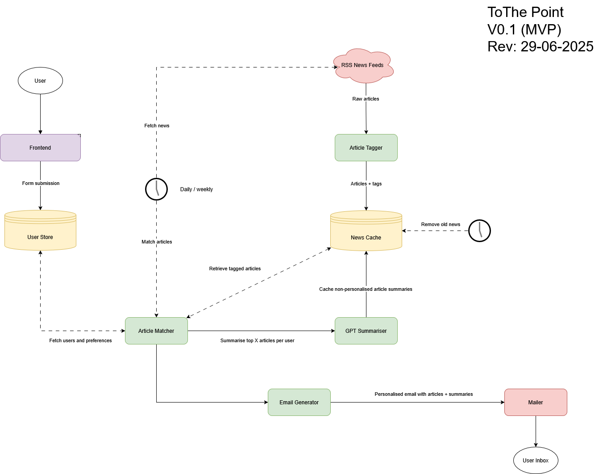

# Architecture Documentation
### Project: ToThePoint

Version: 0.1 (MVP)
Revision Date: 29-06-2025
Overview

ToThePoint is a personalised news summarisation and email delivery system. Users receive concise, relevant summaries of current events, matched to their interests, delivered to their inbox daily or weekly.

## System Components
## 1. Frontend

- Accepts user inputs (e.g. preferences, email frequency, unsubscribe request).
- Submits form data to backend.

## 2. User Store

- Persistent storage of user data and preferences.
- Accessed by the Article Matcher for personalisation.

## 3. RSS News Feeds

- External input source.
- Provides raw news articles on a scheduled basis.

## 4. Article Tagger

- Adds semantic metadata (tags) to raw articles.
- Enables downstream matching and filtering.

## 5. News Cache

- Stores tagged articles temporarily, along with their GPT summaries.
- Deletes outdated articles on a rolling schedule.
- Feeds data to the GPT summarisation pipeline and article matcher.

## 6. GPT Summariser

- Summarises articles using GPT-based models.
- Sends generic (non-user-specific) summaries back to the news cache.

## 7. Article Matcher

- Core logic engine.
- Fetches user preferences and matches them to tagged news.
- Triggers personalised summarisation workflows for top N articles per user.

## 8. Email Generator

- Assembles matched articles and their summaries into an email-ready format.
- Handles layout, personalisation, and metadata insertion.

## 9. Mailer

- Sends generated emails to user inboxes.
- Assumes SMTP or 3rd-party mail API integration.

## Scheduled Jobs

- News Fetching: Pulls from RSS feeds daily/weekly.
- Old News Cleanup: Periodically purges stale data from News Cache.

## Notes & Limitations

- MVP only supports RSS as a source.
- No real-time push; runs are batched and scheduled.
- Summaries are not stored or personalised per-user.